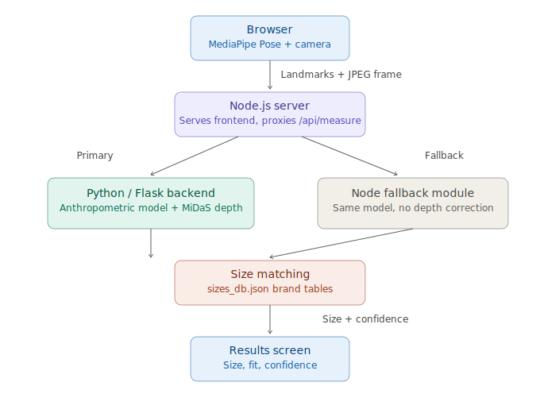

# SmartFitAI

A browser-based virtual fitting assistant. A user stands in front of their webcam, the app estimates their body measurements from pose landmarks, and recommends a clothing size from a brand-specific size chart — no tape measure required.



## What it does

1. The browser uses [MediaPipe Pose](https://developers.google.com/mediapipe) to track 33 body landmarks live from the webcam feed, rendered as a color-coded skeleton overlay (green/amber/red by landmark confidence) so the user can see exactly what the model is tracking in real time — not just a black box behind a status message.
2. Once a full-body pose is detected and held steady for a few frames, the app captures a still frame and the median landmark positions. A progress ring over the torso fills in as the capture stabilizes.
3. That data is sent to a backend, which converts pixel distances into real-world centimeters and estimates shoulder, chest, waist, and hip measurements using a gender-aware anthropometric model.
4. The estimated measurements are matched against a brand's size chart (`server/sizes_db.json`) to recommend a specific size (e.g. "M", "32", "Slim").
5. Results are shown as a body-diagram visualization with measurement callouts, plus a position bar showing exactly where the user's measurement lands within the brand's full size range — not just the single matched size — along with a confidence score so the user knows how much to trust the estimate.

## Why this isn't just "shoulder width times a magic number"

Most simple approaches to camera-based sizing compute one width measurement (e.g. shoulder-to-shoulder pixel distance) and multiply it by a single fixed ratio to estimate chest circumference, regardless of who's standing in frame. That approach has three real problems, and this project's measurement model exists specifically to address them:

- **Body proportions differ by sex.** The ratio between frontal shoulder width and chest circumference is measurably different between male and female populations. A single ratio for everyone systematically over- or under-estimates one group.
- **A frontal width alone can't capture circumference.** Two people with identical shoulder width can have meaningfully different chest circumferences depending on body depth (front-to-back), which a single 2D camera angle can't see directly.
- **Calibration quality matters more than people assume.** If you don't know the real-world scale (cm-per-pixel), every downstream measurement inherits that error. A user's actual height, when provided, is a far more reliable calibration anchor than any visual heuristic — but it has to be weighted as such, not just blended in lightly.

`measure-backend/anthropometry/model.py` addresses all three: gender-specific regression coefficients (distilled from public anthropometric survey ratios), multiple landmark-derived measurements instead of one, height-prioritized calibration, and an optional depth-based correction (see below). It also reports a confidence score driven by actual signal quality (landmark visibility, distance from camera, calibration source) rather than presenting every estimate with false precision.

## Design direction

The visual identity is deliberately playful rather than clinical — scanning your own body with a webcam is a slightly vulnerable moment, so the design leans into a friendly, encouraging tone instead of a sterile measurement-tool aesthetic. The palette is warm and confident: cream surfaces, deep indigo ink for text and structure, coral as the primary accent, with marigold and mint reserved for status signaling (a great fit reads mint-green, not a generic checkmark). Type pairs a rounded, characterful display face (Fredoka) for headlines and big numbers with a warm, highly legible grotesk (Plus Jakarta Sans) for UI and body text.

The signature element is a small tape-measure mascot on the welcome screen — a dial face with tick marks and a coiled tape tail, built entirely in SVG with a subtle idle animation — meant to take the edge off "point your camera at yourself" before the user even gets to the form. The live skeleton overlay on the camera screen and the body-diagram callouts on the results screen draw from the same three-color confidence system (mint/marigold/coral) as the rest of the UI, rather than a separate neon "CV demo" palette — every screen, including the parts rendered live on a `<canvas>` rather than styled with CSS, is meant to look like the same product.

## Architecture

There are two backends that can serve the `/measure` endpoint:

- **Primary: Python / Flask** (`measure-backend/`) — runs the full anthropometric model and, when a captured frame is available, uses [MiDaS](https://github.com/isl-org/MiDaS) monocular depth estimation to derive a rough body-thickness signal that nudges the chest/waist/hip estimates for people photographed at a slight angle or with a deeper-than-average build.
- **Fallback: Node.js** (`server/anthropometry.js`) — a lightweight JS port of the same model (minus depth correction), used automatically if the Python service is unreachable, so the app still works without a Python environment set up. Responses are tagged `"engine": "fallback"` so this is never silent.

The Node.js server (`server/server.js`) always serves the frontend and always receives the initial request; it transparently proxies to the Python service first and only falls back if that call fails or times out.

```
Browser (MediaPipe Pose)
   │  landmarks + JPEG frame
   ▼
Node.js server  ──primary──▶  Python/Flask backend (model + MiDaS depth)
   │                                    │
   └──fallback (if unreachable)──▶  Node fallback module (same model, no depth)
                                        │
                                        ▼
                              Brand size matching (sizes_db.json)
                                        │
                                        ▼
                              Result + confidence score
```

## Project structure

```
SmartFitAI/
├── frontend/                  Static web app (vanilla JS, no build step)
│   ├── index.html
│   ├── styles.css
│   ├── package.json           Test script only - no build/bundling
│   ├── test/                  node --test unit tests (pose-gating logic)
│   └── src/
│       ├── app.js             Flow control, API calls, results rendering
│       ├── scanEngine.js      MediaPipe Pose integration, skeleton overlay, capture gating
│       ├── resultsViz.js      Results-screen body diagram + size-range bar
│       ├── sizeEngine.js      Client-side pose-quality feedback, formatting
│       ├── audioGuide.js      Spoken status updates (Web Speech API)
│       └── ui.js              Small DOM helpers
│
├── server/                    Node.js: static file server + API proxy/fallback
│   ├── server.js
│   ├── anthropometry.js       Fallback measurement model (mirrors Python)
│   ├── sizeMatch.js           Brand size-chart matching
│   ├── sizes_db.json          Brand size charts (shared by both backends)
│   └── test/                  node --test unit tests
│
├── measure-backend/           Python/Flask: primary measurement engine
│   ├── measure_server.py      Flask app, MiDaS depth pipeline, validation
│   ├── anthropometry/
│   │   ├── model.py           The core measurement model (see above)
│   │   └── size_match.py      Brand size-chart matching (mirrors Node version)
│   ├── tests/                 pytest unit tests
│   ├── requirements.txt
│   ├── setup_midas.py         Vendors MiDaS locally (see "MiDaS setup" below)
│   └── vendor/                Created by setup_midas.py - local MiDaS clone (gitignored)
│
└── docs/
    └── architecture.svg
```

## MiDaS setup: why there's a `setup_midas.py` instead of just `torch.hub.load(...)`

The straightforward way to load MiDaS is a single line: `torch.hub.load("intel-isl/MiDaS", "MiDaS_small")`. That line does three separate network-dependent things before it gets to the actual model weights:

1. Calls the **GitHub REST API** to check whether the ref you asked for is a branch or a tag.
2. Calls the **GitHub REST API again** to confirm the repo isn't a malicious fork — this runs even with `trust_repo=True`, because that flag only controls whether you're *prompted*, not whether the check itself runs.
3. MiDaS's own `hubconf.py` internally calls `torch.hub.load()` a *second* time, on an entirely different repo (`rwightman/gen-efficientnet-pytorch`), to fetch its backbone. That nested call doesn't inherit your `trust_repo` argument at all, so on a fresh cache it either hits an interactive `y/N` prompt — which crashes a non-interactive server process with `EOFError` — or repeats steps 1–2 against the second repo.

On networks that block or rate-limit the GitHub REST API specifically (common on corporate networks, CI runners, and some sandboxed environments) while still allowing plain `git clone` over HTTPS, step 2 fails with an HTTP error. A bug in torch's own error handling — it unconditionally tries to delete a response header that's only present on some failure paths — turns that into a confusing `KeyError: 'Authorization'` instead of a clear network error. That's a real, reproducible bug in `torch.hub` itself, not something specific to this project.

`setup_midas.py` works around all of it by vendoring (`git clone`-ing directly) both MiDaS and its nested dependency, and pre-populating torch.hub's trust list — since a plain `git clone` only needs HTTPS access to `github.com` itself, not its REST API, it succeeds in exactly the environments where `torch.hub`'s own download path fails. `measure_server.py` checks for this vendored clone first and uses it automatically if present, falling back to the default `torch.hub` path otherwise.

This is worth knowing about even if you never hit it yourself: it's the kind of failure that looks like "the library is broken" until you actually read the traceback past the first exception and find the real cause three network calls deep.

## Running it locally

### 1. Primary backend (Python)

```bash
cd measure-backend
python3 -m venv venv
source venv/bin/activate        # On Windows: venv\Scripts\activate
pip install -r requirements.txt

# Recommended: vendor MiDaS locally instead of relying on torch.hub's
# default GitHub-API-backed download path. This matters on corporate
# networks, CI runners, or any environment that blocks/rate-limits the
# GitHub REST API specifically (a real, documented torch.hub
# fragility - see setup_midas.py's module docstring for the full
# writeup of what actually goes wrong and why). Requires `git`.
python setup_midas.py

python measure_server.py
```

The Flask server starts on `http://localhost:5000`. If MiDaS fails to load (no internet, GitHub access blocked, etc.), the server still starts — it just runs without depth correction, and logs a warning. Check `GET /health` to confirm: `{"midas_loaded": true|false}`.

### 2. Node server (always required — serves the frontend too)

```bash
cd server
npm install
npm start
```

This starts on `http://localhost:3000` and serves the frontend at that address. Open it in Chrome and allow camera access when prompted.

If the Python service isn't running, `/api/measure` still works — it transparently falls back to the local JS model, just without depth correction and with a `confidence` score that reflects the reduced calibration quality.

### 3. Try it

1. Open `http://localhost:3000`.
2. Enter your height (optional, but significantly improves accuracy — see the methodology section above), pick a gender, category, item, and brand.
3. Stand back so your full body is visible, hold still when prompted.
4. Review your estimated measurements, confidence score, and recommended size.

## Deploying it so others can use it (incl. on a phone)

The frontend needs a real camera, so "use it on mobile" means opening it in a mobile browser — there's no separate app build. The Node server already serves the frontend and exposes `/api/measure`, so anyone on the same network as it (or anywhere, if it's deployed) can open it from their phone's browser.

A few things worth knowing if you're deploying to a free tier specifically (Render, Railway, Fly.io, etc.):

- **Torch's default PyPI wheel bundles full CUDA support and is 500MB+**, even though `measure_server.py` only ever runs on CPU in this kind of deployment (`DEVICE = torch.device("cuda" if torch.cuda.is_available() else "cpu")` — it uses CUDA opportunistically, never requires it). That CUDA bloat is usually what blows past a free host's build-size or disk limit, not MiDaS itself. Installing from the CPU-only index (`https://download.pytorch.org/whl/cpu`) instead typically brings `torch` down to ~150-200MB — see the comments in `measure-backend/requirements.txt` for the exact flag to use, since how you pass it depends on whether your host reads `requirements.txt` directly or runs a custom build command.
- **MEASURE_BACKEND_URL** (read by `server/server.js`) needs to point at wherever the Python service ends up running, not `localhost`, once they're on separate hosts.
- If the Python service's free tier is too constrained to run at all, `server.js` automatically falls back to its own JS-only measurement model (`server/anthropometry.js`) — slightly less accurate (no depth correction), but a real, tested fallback rather than a broken deploy. Responses are tagged `"engine": "fallback"` so this is never silent.
- `setup_midas.py`'s git-based vendoring (see above) is worth running as part of your build step on a new host too, for the same GitHub-API-reliability reasons it matters locally.

## Testing

All three layers have unit test suites: the measurement model and size matching on both backends, and the pure pose-gating/skeleton logic on the frontend (everything that doesn't require an actual camera or browser canvas).

```bash
# Python backend (31 tests)
cd measure-backend
pytest tests/ -v

# Node.js backend (22 tests)
cd server
npm test

# Frontend logic (30 tests)
cd frontend
npm test
```

A few of these tests are regression tests for real bugs found and fixed during development — for example, a height-validation inconsistency that let an implausible height value (e.g. `999`) partially leak into the fallback calibration path instead of being cleanly rejected, and a check that every skeleton "bone" drawn on the live pose overlay has a matching joint at both ends (so a line never renders with a missing dot). They're kept in the suite specifically so those classes of bug can't silently reappear.

## Known limitations

This is an honest list, not a disclaimer buried in fine print:

- **Single-camera 2D measurement has a real accuracy ceiling.** No matter how good the calibration, a single RGB frame cannot fully resolve body depth. The depth correction step narrows this gap but doesn't eliminate it — this is communicated to the user via the confidence score rather than hidden.
- **MiDaS's pretrained weights are hosted on GitHub Releases**, which redirects to a separate CDN domain at request time. `setup_midas.py` resolves the GitHub-REST-API issues (see above), but if that CDN domain itself is blocked, the final weights download can still fail — in which case the server logs it and runs without depth correction rather than crashing. The error message in that case includes a manual-download fallback.
- **The regression coefficients are approximations**, distilled from public anthropometric summary statistics, not a proprietary motion-capture dataset. They're a meaningful improvement over a single fixed ratio, but won't match a professional tailor's tape measurement.
- **Lighting and clothing affect pose detection quality**, which is why the app gates capture on landmark visibility and pose stability rather than capturing the first frame it sees.

## Possible next steps

- Multi-frame depth averaging instead of a single captured frame, to reduce noise in the depth-based thickness correction.
- A calibration mode using a known-size reference object (e.g. a credit card held against the body) for users who don't want to enter their height.
- Expanding `sizes_db.json` brand coverage and adding a contribution format for new brands.
